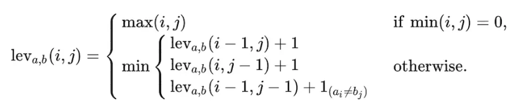
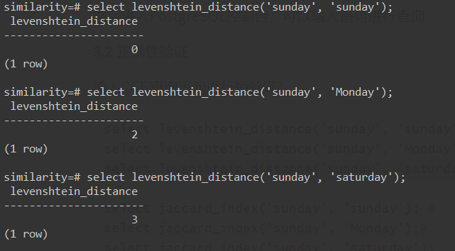
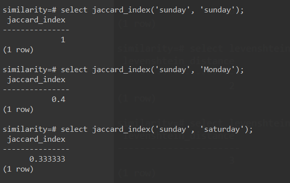
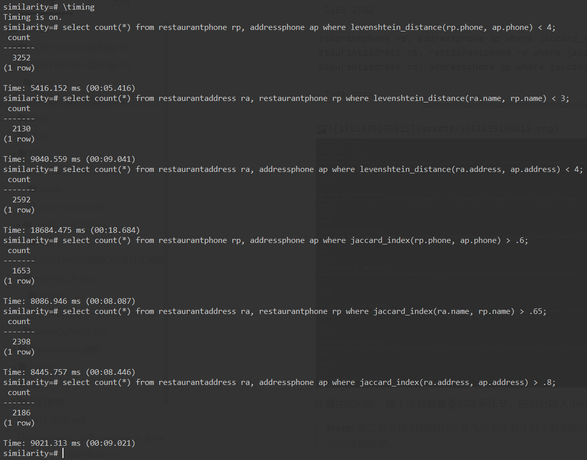
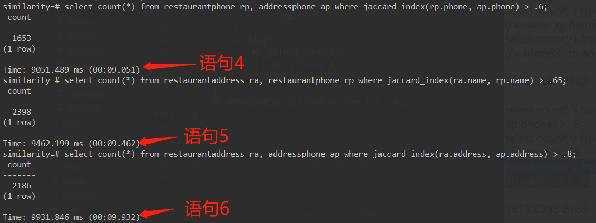

<center> <font size=5> <b>Postgresql实验报告</b></font>
</center>
<p align=right> <strong>聂希瑞 16307130133</strong></p>

[TOC]

#### 一、实验目的

​		通过阅读理解PostgreSQL数据库源码，修改源码，添加两个函数计算Levenshtein Distance和Jaccard Index，并对算法进行优化，体会数据库查询的底层原理。

#### 二、实验原理

##### 1. Levenshtein Distance (编辑距离)

​		编辑距离是指从字符串a变化到字符串b的最小操作距离。在这里定义三个操作：插入，删除，替换。插入一个字符、删除一个字符和替换一个字符的代价都是1。编辑距离越小证明两个字符串相似度越高。可以用动态规划的方法实现该算法。

##### 2. Jaccard Index (Jaccard 相似系数)

​		Jaccard系数的计算方法是，把字符串A和B分别拆成二元组的集合，首字符和和尾字符分别用$在开头和结尾连接成一个二元组，如 “apple” -> {$a, ap, pp, pl, le, e$}, “apply” -> {$a, ap, pp, pl, ly, y$}，然后计算两个集合的交集除以两个集合的并集得到结果。结果越大证明两个字符串相似度越高。该算法可以用hash方法实现。

##### 3. 实验环境工

Linux DESKTOP-MEPTG26 4.4.0-18362-Microsoft #1-Microsoft Mon Mar 18 12:02:00 PST 2019 x86_64 x86_64 x86_64 GNU/Linux

#### 三、实验内容

##### 1. 下载安装源码

使用wget命令下载源码安装包并用tar -xvf命令解压缩。

```shell
wget -c https://ftp.postgresql.org/pub/source/v10.4/postgresql-10.4.tar.gz
tar -xvf xxx
```

##### 2. 编辑代码

要修改的代码的路径在：

>   postgresql-10.4/src/backend/utils/fmgr/funcapi.c
>   postgresql-10.4/src/include/utils/builtins.h
>   postgresql-10.4/src/include/catalog/pg_proc.h

我们需要在postgresql-10.4/src/backend/utils/fmgr/funcapi.c文件下添加两个函数，并在builtins.h头文件中声明这两个函数。然后还需要再pg_proc.h文件中添加如下代码：

```c
DATA(insert OID = 6789 ( levenshtein_distance PGNSP PGUID 12 1 0 0 0 f f f f t f i s 2 0 23 "25 25" _null_ _null_ _null_ _null_ _null_ levenshtein_distance _null_ _null_ _null_ ));
DESCR("levenshtein_distance");
DATA(insert OID = 9999 ( jaccard_index PGNSP PGUID 12 1 0 0 0 f f f f t f i s 2 0 700 "25 25" _null_ _null_ _null_ _null_ _null_ jaccard_index _null_ _null_ _null_ ));
DESCR(" jaccardindex ");
```

>   **Note:** OID不能与之前的OID重复。

###### 2.1 levenshtein distance

**算法解读**：以lev (i, j)表示字符串A第i个字符到字符串B第j个字符的编辑距离，我们很容易有：



​		如果i, j中有一个值是0（空串），那么显然编辑距离就是另一个非空字符串的长度。如果两者都不为0，则当前lev(i, j)的值一定是lev(i-1, j) +1 (插入)， lev(i, j-1) + 1 (删除)，lev(i-1, j-1) + 1（替换）中的最小的代价；其中如果当前字符A[i] == B[i]，那么lev(i, j) = lev(i-1, j-1)。由此写出下列代码。

```c
Datum levenshtein_distance(PG_FUNCTION_ARGS)
{
	static int d[110][110];
	int i, j;
	text * str_01 = PG_GETARG_DATUM(0);
	text *txt_02 = PG_GETARG_DATUM(1);
	char *a = VARDATA_ANY(str_01);
	char *b = VARDATA_ANY(txt_02);
	int m = VARSIZE_ANY_EXHDR(str_01); //length a
	int n = VARSIZE_ANY_EXHDR(txt_02); //length b
	for(i = 0; i < m; i++)
		d[i][0] = i;
	for(j = 0; j < n; j++)
		d[0][j] = j;
	for(j = 1; j <= n; j++){
		for(i = 1; i <= m; i++){
			if(tolower(a[i-1]) == tolower(b[j-1]))
				d[i][j] = d[i-1][j-1];
			else{
				d[i][j] = (d[i-1][j] + 1) < (d[i][j-1] + 1)
							? (d[i-1][j] + 1)
							: (d[i][j-1] + 1); // deletion or insertion;
				d[i][j] = d[i][j] < (d[i-1][j-1] + 1)
							? d[i][j]
							: (d[i-1][j-1] + 1); //substitution;
			}
		}
	}
	PG_RETURN_INT32(d[m][n]);
}
```

>**Note:** 这是最初版本的编辑距离算法，用了动态规划的思想实现，空间复杂度为一个110x110的二维矩阵的代价，时间复杂度为O(n*m)。

###### 2.2 levenshtein distance 编译优化

​		将O0优化级别改成O3，进行测试。

###### 2.3 levenshtein distance 空间复杂度优化

​		这一级别的优化思路在于，整个算法虽然用了一个二维矩阵，但是真正用到的只有二维矩阵的两行，已经计算过的值可以被矩阵释放掉，因此只需要开两行空间就可以完成对整个过程的计算，减少了很多空间浪费。但是对测试时间的优化可以忽略不计。

```c
Datum levenshtein_distance(PG_FUNCTION_ARGS)
{
	static intd[2][110];
	int i, j;
	text * str_01 = PG_GETARG_DATUM(0);
	text *txt_02 = PG_GETARG_DATUM(1);
	char *a = VARDATA_ANY(str_01);
	char *b = VARDATA_ANY(txt_02);
	int m = VARSIZE_ANY_EXHDR(str_01); //length a
	int n = VARSIZE_ANY_EXHDR(txt_02); //length b

	for(j = 0; j <= n; j++)
		d[0][j] = j;
	for(i = 1; i <= m; i++){
		d[1][0] = i;
		for(j = 1; j <= n; j++){
			if(tolower(a[i-1]) == tolower(b[j-1]))
				d[1][j] = d[0][j-1];
			else{
				d[1][j] = (d[0][j] + 1) < (d[1][j-1] + 1)
							? (d[0][j] + 1)
							: (d[1][j-1] + 1); // deletion or insertion;
				d[1][j] = d[1][j] < (d[0][j-1] + 1)
							? d[1][j]
							: (d[0][j-1] + 1); //substitution;
			}
		}
		for(j = 0; j <= n; j++)
			d[0][j] = d[1][j];
	}	
	PG_RETURN_INT32(d[m][n]);
```

###### 2.4 levenshtein distance 时间复杂度优化

​		经过查阅资料发现，其实在计算该矩阵时，一旦d[i] [j]已经超过某一个值时，已经可以不用接着计算了，说明这个结果已经不合法了可以直接退出。因此会节省大量的时间。但是因为能力和时间的问题，并没有来得及做时间复杂度的优化。已经找到一篇参考论文，其最优的时间复杂度大概在O(k*min{m, n})的级别，比m * n的复杂度要省不少时间。

```c
Datum levenshtein_distance_2(PG_FUNCTION_ARGS)
{
	// static int d[110][110];
	static int d[2][110];
	int i, j;
	text * str_01 = PG_GETARG_TEXT_P(0);
	text *txt_02 = PG_GETARG_TEXT_P(1);
	int len = PG_GETARG_INT32(2) - 1;
	char *a = VARDATA_ANY(str_01);
	char *b = VARDATA_ANY(txt_02);
	int m = VARSIZE_ANY_EXHDR(str_01); //length a
	int n = VARSIZE_ANY_EXHDR(txt_02); //length b
	int flag = 1;
	for(j = 0; j <= n; j++)
		d[0][j] = j;
	for(i = 1; i <= m; i++){
		d[1][0] = i;
		flag = 1;
		for(j = 1; j <= n; j++){		
			if(tolower(a[i-1]) == tolower(b[j-1]))
				d[1][j] = d[0][j-1];
			else{
				int x = d[0][j] + 1;
				int y = d[1][j-1] + 1;
				int z = d[0][j-1] + 1;
				d[1][j] = x < y
						  ?(x < z ? x : z)
						  :(y < z ? y : z);
			}
			if(d[1][j] <= len)
				flag = 0;
		}
		if(flag)
			PG_RETURN_BOOL(0);
		for(j = 0; j <= n; j++)
			d[0][j] = d[1][j];
	}
	PG_RETURN_BOOL(d[1][n] <= len ? 1 : 0);
}
```

###### 2.5 Jaccard Index

**算法理解：**思路很简单，因为最多只有128个字符，构造一个128X128的哈希桶，将两个字符串都扫一遍。

​		在扫描字符串A时，碰到任意二元组”ab”, 检查对应的桶hash[‘a’] [‘b’]里的值：

​		如果里面的值为0，说明这个二元组还没出现过，就把“ab”的二元组对应的桶hash[‘a’] [‘b’]的值置为1，同时把并的元素个数统计值加一；如果对应哈希桶里的值为1，表示已经出现在A中了，那么就忽略这个二元组（去重）。

扫完A之后，开始扫描B：碰到任意二元组”ab”, 检查对应的桶hash[‘a’] [‘b’]里的值：

​		如果里面的值为0，说明这个二元组还没出现过，就把“ab”的二元组对应的桶hash[‘a’] [‘b’]的值置为2，表示这个二元组已经在B中出现过了；如果桶里的值为1，说明这个二元组在A中已经出现过，这个时候就把表示交集的二元组个数统计值加1，并且把桶里的值从1改为2，表示下次再在B中碰见这个二元组就不用统计了，已经统计过了（去重）。如果桶里的值是2，那么什么也不做，直接忽略。

把A和B都扫描一遍过后，就得到了交和并各自的二元组个数，再相除得到结果。

```c
Datum jaccard_index(PG_FUNCTION_ARGS)
{
	static int h[128][128];
	int i, j;
	text * str_01 = (text *)PG_GETARG_TEXT_P(0);
	text * str_02 = (text *)PG_GETARG_TEXT_P(1);
	int m = VARSIZE_ANY_EXHDR(str_01); //length a
	int n = VARSIZE_ANY_EXHDR(str_02); //length b
	char *a = VARDATA_ANY(str_01);
	char *b = VARDATA_ANY(str_02);
	int inter = 0, unions = 0;
	
	float4 result = 0.0;
	memset(h, 0, sizeof(h));
	for(i = 0; i < m; i++)
		a[i] = tolower(a[i]);
	for(j = 0; j < n; j++)
		b[j] = tolower(b[j]);
	if(!m && !n)
		PG_RETURN_FLOAT4(1.0);
	else if(m && n){
		//scan a;
		//head and tail
		h['$'][a[0]] = 1;
		h[a[m-1]]['$'] = 1;
		unions += 2;
		
		for(i = 0; i < m-1; i++){
			//not found in hash bucket
			if(!h[a[i]][a[i+1]]){
				h[a[i]][a[i+1]] = 1;
				unions++;
			}
		}
		if(h['$'][b[0]] == 1)
			inter++;
		else unions++;
		
		if(h[b[n-1]]['$'] == 1)
			inter++;
		else unions++;

		for(j = 0; j < n-1; j++){
			if(h[b[j]][b[j+1]] == 0){
				h[b[j]][b[j+1]] = 2; //it means it occurs in b;
				unions++;
			}
			else if(h[b[j]][b[j+1]] == 1){
				//it occurs in a;
				inter++;
				h[b[j]][b[j+1]] = 2;
			} 
			// else if(h[b[j]][b[j+1]] == 2){
			// 	//it occurs in b; pass;
			// }
		}
		result = (float4) inter / (float4) unions;
	}
	PG_RETURN_FLOAT4(result);

}
```


###### 2.6 Jaccard Index编译优化

​		同样的，将O0优化级别改成O3，进行测试。

###### 2.7 Jaccard Index空间复杂度优化

​		因为把A和B都扫描一遍的操作是必须的，因而O(m+n)已经是最好的时间复杂度，没有什么从算法上优化的空间，但是空间复杂度上还有一定的节约空间。比如观察ASCII码表就可以发现，ASCII表中32之前的字符是基本不会出现在数据库的值中的，因此可以将空间开小一点，从128x128变成96x96；再者，因为hash值都是正整数，可以把int改成u_int32_t类型，节省更多的空间。

```c
Datum jaccard_index(PG_FUNCTION_ARGS)
{
	static u_int32_t h[96][96];
	int i, j;
	text * str_01 = (text *)PG_GETARG_TEXT_P(0);
	text * str_02 = (text *)PG_GETARG_TEXT_P(1);
	int m = VARSIZE_ANY_EXHDR(str_01); //length a
	int n = VARSIZE_ANY_EXHDR(str_02); //length b
	char *a = VARDATA_ANY(str_01);
	char *b = VARDATA_ANY(str_02);
	int inter = 0, unions = 0;
	
	float4 result = 0.0;
	memset(h, 0, sizeof(h));
	for(i = 0; i < m; i++)
		a[i] = tolower(a[i]);
	for(j = 0; j < n; j++)
		b[j] = tolower(b[j]);
	if(!m && !n)
		PG_RETURN_FLOAT4(1.0);
	else if(m && n){
		//scan a;
		//head and tail
		h['$' - 32][a[0] - 32] = 1;
		h[a[m-1] - 32]['$' - 32] = 1;
		unions += 2;
		
		for(i = 0; i < m-1; i++){
			//not found in hash bucket
			a1 = a[i] - 32; a2 = a[i+1] - 32;
			if(!h[a1][a2]){
				h[a1][a2] = 1;
				unions++;
			}
		}
		if(h['$' - 32][b[0] - 32] == 1)
			inter++;
		else unions++;
		
		if(h[b[n-1] - 32]['$' - 32] == 1)
			inter++;
		else unions++;

		for(j = 0; j < n-1; j++){
			b1 = b[j] - 32;
			b2 = b[j+1] - 32;
			if(h[b1][b2] == 0){
				h[b1][b2] = 2; //it means it occurs in b;
				unions++;
			}
			else if(h[b1][b2] == 1){
				//it occurs in a;
				inter++;
				h[b1][b2]] = 2;
			} 
			// else if(h[b[j]][b[j+1]] == 2){
			// 	//it occurs in b; pass;
			// }
		}
		result = (float4) inter / (float4) unions;
	}
	PG_RETURN_FLOAT4(result);
}
```

>   **Note: **哈希虽然在时间复杂度上足够优化，但是空间复杂度上还可以接着优化，就是把96x96的哈希桶开小一点，减小memset()的代价，此处限于时间关系，没有对哈希进行优化。

##### 3. 验证结果

###### 3.1 验证流程

依次输入以下命令行：

```shell
/home/simon/pgsql/bin/pg_ctl -D /home/simon/pgsql/data -l logfile stop
rm -r $HOME/pgsql
./configure --enable-depend --enable-cassert --enable-debug CFLAGS="-O0" 
--prefix=$HOME/pgsql --without-readline --without-zlib
# ./configure --enable-depend --enable-cassert --enable-debug CFLAGS="-O3" 
# --prefix=$HOME/pgsql --without-readline --without-zlib
make
make install
$HOME/pgsql/bin/initdb -D $HOME/pgsql/data --locale=C
/home/simon/pgsql/bin/pg_ctl -D /home/simon/pgsql/data -l logfile start
$HOME/pgsql/bin/psql -p 5432 postgres -c 'CREATE DATABASE similarity;'
$HOME/pgsql/bin/psql -p 5432 -d similarity -f $HOME/
		pj/postgresql-10.4/data_file/similarity_data.sql
$HOME/pgsql/bin/psql similarity
```

然后进入PostgreSQL控制台，可以输入语句进行查询

###### 3.2 正确性验证

输入以下查询语句进行**短验证**：

```mysql
select levenshtein_distance('sunday', 'sunday'); #0
select levenshtein_distance('sunday', 'Monday'); #2
select levenshtein_distance('sunday', 'saturday');#3

select jaccard_index('sunday', 'sunday'); #1
select jaccard_index('sunday', 'Monday'); #0.4
select jaccard_index('sunday', 'saturday');#0.3333...
```





输入以下查询语句进行**长验证**：

```mysql
select count(*) from restaurantphone rp, addressphone ap 
				where levenshtein_distance(rp.phone, ap.phone) < 4;
select count(*) from restaurantaddress ra, restaurantphone rp 
				where levenshtein_distance(ra.name, rp.name) < 3;
select count(*) from restaurantaddress ra, addressphone ap 
				where levenshtein_distance(ra.address, ap.address) < 4;
-- result should be 3252 2130 2592

select count(*) from restaurantphone rp, addressphone ap 
				where levenshtein_distance_2(rp.phone, ap.phone, 4);
select count(*) from restaurantaddress ra, restaurantphone rp 
				where levenshtein_distance_2(ra.name, rp.name, 3);
select count(*) from restaurantaddress ra, addressphone ap 
				where levenshtein_distance_2(ra.address, ap.address, 4);
-- result should be 3252 2130 2592

select count(*) from restaurantphone rp, addressphone ap 
				where jaccard_index(rp.phone, ap.phone) > .6;
select count(*) from restaurantaddress ra, restaurantphone rp 
				where jaccard_index(ra.name, rp.name) > .65;
select count(*) from restaurantaddress ra, addressphone ap 
				where jaccard_index(ra.address, ap.address) > .8;
-- result should be 1653 2398 2186
```



正确性没问题，接下来是最重要的效率环节。控制台输入\timing，然后进入查询。

###### 3.3 优化效率测试

| 执行语句 | 未优化(O0)(秒) | O3(秒) | O3+空间优化(秒) | O3+时空间优化(秒) | 最大优化幅度 |
| :------: | :------------: | :----: | :-------------: | :---------------: | :----------: |
|  语句1   |     15.271     | 6.557  |      5.512      |       3.365       |    4.54倍    |
|  语句2   |     30.585     | 11.076 |     11.753      |       3.102       |    9.86倍    |
|  语句3   |     67.083     | 19.883 |     19.975      |       5.125       |   13.01倍    |
|  语句4   |     13.891     | 12.590 |      7.059      |        无         |    1.97倍    |
|  语句5   |     14.802     | 12.573 |      8.240      |        无         |    1.71倍    |
|  语句6   |     15.985     | 13.083 |      8.720      |        无         |    1.83倍    |




###### 3.4 综合查询

输入下列语句，将查询的结果写入txt文件：

```shell
$HOME/pgsql/bin/psql similarity -c 
		"SELECT ra.address, ap.address, ra.name, ap.phone 
		 FROM restaurantaddress ra, addressphone ap 
		 WHERE levenshtein_distance_2(ra.address, ap.address, 4) 
		 AND(ap.address LIKE '%Berkeley%' OR ap.address LIKE '%Oakland%')
		 ORDER BY 1, 2, 3, 4;" > levenshtein_1.txt

$HOME/pgsql/bin/psql similarity -c 
		"SELECT rp.phone, ap.phone, rp.name, ap.address 
		FROM restaurantphone rp, addressphone ap 
		WHERE jaccard_index(rp.phone, ap.phone) > .6 
		AND (ap.address LIKE '% Berkeley%' OR ap.address LIKE '% Oakland %') 
		ORDER BY 1, 2, 3, 4;" > levenshtein_2.txt

$HOME/pgsql/bin/psql similarity -c 
		"SELECT ra.name, rp.name, ra.address, ap.address, rp.phone, ap.phone 
		FROM restaurantphone rp, restaurantaddress ra, addressphone ap 
		WHERE jaccard_index(rp.phone, ap.phone) >= .55 
		AND levenshtein_distance_2(rp.name, ra.name, 6) 
		AND jaccard_index(ra.address, ap.address) >= .6 
		AND (ap.address LIKE '% Berkeley%' OR ap.address LIKE '% Oakland %')
		ORDER BY 1, 2, 3, 4, 5, 6;" > levenshtein_3.txt
```

结果存储在levenshtein_1.txt, levenshtein_2.txt, levenshtein_3.txt中。

#### 四、反思收获

##### 1. 问题与解决办法

（1）上手的过程中，一开始不太理解整个源码安装编译的过程，后来到处找资料，找到了15级这个task的PPT。

（2）函数优化的时候，对两个算法的实现机制有了更为深刻的了解。

（3）为了方便重安装、重编译的过程，写了一个脚本来做这个事。

##### 2. 结论与收获

（1）结论：在算法时间复杂度已经基本确定的情况下，能够通过减少不必要的空间的利用、访问来优化查询效率，提高高达十几倍的优化效率。

（2）收获：掌握了Levenshtein Distance的算法实现和Jaccard Index 的算法实现，掌握了基本的优化方法。

##### 3. 提高与扩展

​		受限于时间关系，在Jaccard Index的计算中，本可以实现一个更好的哈希算法，进一步将效率提高到3秒左右，但是并没来得及实现。这是本次实验不足的部分。

#### 五、参考文献

[1] <https://en.wikipedia.org/wiki/Levenshtein_distance>

[2] <https://en.wikipedia.org/wiki/Jaccard_index>

[3] <https://www.postgresql.org/files/documentation/pdf/10/postgresql-10-A4.pdf>

[4] 2015期末实验.pdf

